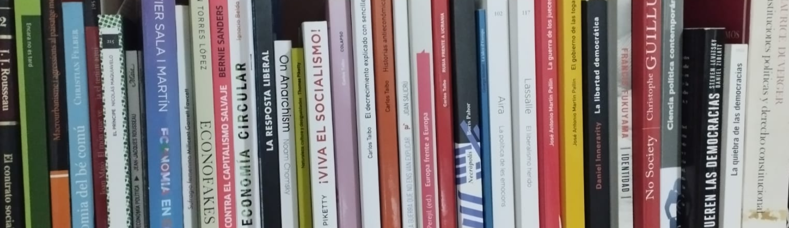

---
output:
  html_document: default
  pdf_document: default
---
# Ciencia política y gestión pública
|||
|:---------|--:|
|{width=100%}|Tomàs Ferrandis Moscardó tomasferrandis@gmail.com   {width=40%}| |

El contenido de este repositorio está relacionado con el _Grado Universitario de Ciencia Política y Gestión Pública_ de la [_Universidad de Burgos (online)_](https://www.ubu.es/).

Principalmente se trata de trabajos de las asignaturas cursadas y alguna simple de investigación o artículo sin relación directa con las actividades propias del Grado.

El procesamiento de datos se realiza mediante el [lenguaje de programación R](https://smowl.net/es/blog/lenguaje-r/) y el código estará visible en anexos, cuando no en el propio texto. Los documentos *html* y *pdf* han sido generados a partir de los originales codificados en Markdown o RMarkdown, estando todos disponibles.

## Elecciones y encuestas
|||
------------------------- | -- | --
1. [Ejemplo sencilo dde *R Markdown*. Resultados en elecciones autonómicas en la comarca de La Safor (Valencia)](elecciones/lasafor/SAFOR.html)||
2. [Investigación sobre el voto valencianista en las Elecciones Autonómicas del 2023](elecciones/elvotovalencianistaEA2023/votovalencianista-ea2023.html)||
3. [El sistema de partidos políticos alemán tras las elecciones de 2021](elecciones/alemanas2021/alemanas2021.html)||
4. [La polarización a les Corts Valencianes](elecciones/polarizacionvalenciana/polarizacionvalenciana.html)||
5. [Análisis univariable sobre preferencia de presidente/a de Gobierno según barómetro de julio de 2023 (Estudio 3415)](elecciones/estudioCIS3415/preferenciaPte.html)||
6. [Análisis univariable sobre probabilidad de voto según barómetro de julio de 2023 (Estudio 3415)](elecciones/estudioCIS3415/probabilidadVoto.html)||

## Economía pública
||
--------------------------|--|--
1. [El papel del Estado](economiapublica/elpapeleconomicodelestado/Elpapeleconomicodelestado.html)||
2. [La regulación de los monopolios](economiapublica/laregulaciondelosmonopolios/Laregulaciondelosmonopolios.html)||
3. [El presupuesto local ](economiapublica/elpresupuestolocal/Elpresupuestolocal.html)||
4. [Sobre los principios tributarios](economiapublica/losprincipiostributarios/Losprincipiostributarios.html)||

## Artículos varios

1. [Sufragismo](articulosvarios/sufragismo/sufragismo.html)
2. [La era de la revolución](articulosvarios/laeradelarevolucion/laeradelarevolucion.html)
3. [El efecto Guggenheim](articulos/elefectoguggenheim/elefectoguggenheim.html)
4. [La gobernanza frente a las corporaciones](articulosvarios/corporacion/corporacion.html)

## Administración
### Informes
1. [Despoblamiento en el País Valenciano](administracion/despoblamientoPV/Despoblamientoenlacomunidadvalenciana.html)

### Supuestos Derecho Administrativo
2. [Sobre federaciones deportivas](administracion/supuestosderechoadministrativo/Casopractico1.html)
3. [Sobre orden autonómica de restricción por pandemia](administracion/supuestosderechoadministrativo/Casopractico2.html)

 
|||
|:--------|--:|
| *Ciencia política y gestión pública © 2024 by Tomàs Ferrandis Moscardó is licensed under CC BY-NC-ND 4.0* |{width=30%}|
